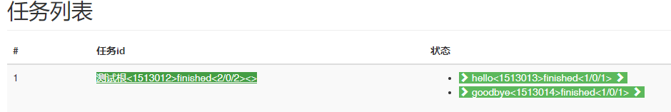
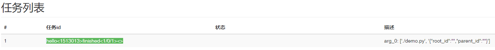

# 监控系统脚本启动器

为了实现对一个模块的无侵入式监控，我们设计了一个脚本启动器：
> jiliang_process/boot/starter.py

使用脚本启动器启动一个python脚本，就像python pdb那样：

> python jiliang_process/boot/starter.py ./hello.py

脚本启动器在运行时会载入一个配置文件start_conf.ini：
```
[deco]
deco_module_path=.

[to_deco]
data_from_pg.pg_data@BaseDB.read_tb_df = jiliang_process.process_monitor.task_monitor.deco_normal
data_from_pg.pg_data@semantics_res_get = jiliang_process.process_monitor.task_monitor.deco_normal
jiliang_process.boot.demo_part_2@hello = jiliang_process.process_monitor.task_monitor.deco_normal
jiliang_process.boot.demo_part_2@goodbye = jiliang_process.process_monitor.task_monitor.deco_normal
jiliang_process.boot.demo_part_2@main = jiliang_process.process_monitor.task_monitor.deco_root
prepare_main@merge_stage = jiliang_process.process_monitor.task_monitor.deco_normal
prepare_main@lane_curb_main = jiliang_process.process_monitor.task_monitor.deco_normal
prepare_main@get_gp_data1 = jiliang_process.process_monitor.task_monitor.deco_normal
prepare_main@get_gp_data = jiliang_process.process_monitor.task_monitor.deco_normal
```

start_conf.ini  指明了应该去哪个模块加载函数装饰器[deco], 并且应该把这个装饰器应用到哪个函数模块上[to_deco]。 

当被执行模块执行python 的 import方法时，启动器会将待import的模块与配置文件中配置项的左边进行比对，若匹配成功，则会将@符号后面的部分使用对应的装饰器装饰。

例如有下面的程序：

```
# demo_part_2.py

import sys

def hello(s):
    print("hello %s"%s)


def goodbye(s):
    print("goodbye %s"%s)


def main():
    print("demo main start")
    hello(sys.argv)
    goodbye(sys.argv)
    print("demo main ends")


if __name__ == "__main__":
    main()
```

```
# demo.py
from jiliang_process.boot.demo_part_2 import *


if __name__ == "__main__":
    main()
```

配置文件可以这么写:
```
[deco]
deco_module_path=.

[to_deco]
jiliang_process.boot.demo_part_2@hello = jiliang_process.boot.deco_module1.demo_deco_normal
jiliang_process.boot.demo_part_2@goodbye = jiliang_process.boot.deco_module1.demo_deco_normal
jiliang_process.boot.demo_part_2@main = jiliang_process.process_monitor.task_monitor.deco_root
```

装饰器 jiliang_process.boot.deco_module1.demo_deco_normal 如此定义
```
from jiliang_process.process_monitor import task_monitor

demo_deco_normal = task_monitor.normal_task_deco(show_position_arg=0)
```


使用./starter.py执行./demo.py

```
python starter.py ./demo.py {\"root_id\":\"\",\"parent_id\":\"\"}
```
**注意后面的参数 {\"root_id\":\"\",\"parent_id\":\"\"} 是跨进程监视装饰器的要求**

运行结果：

```
start ------------------- ['starter.py', './demo.py', '{"root_id":"","parent_id":""}']
extracting monitor_params_from_str
lee_debug
2021-05-11 14:40:08,470 - INFO: {"call_category": 3, "sub_id": 1513011, "parent_id": "", "root_id": "", "name": "\u811a\u672c\u542f\u52a8\u5668", "state": 0, "timestamp": 1620715208.4704268, "location": "unknown,unknown"}
lee_debug current E:\workspace\jiliang_monitor_pr\src\jiliang_process\boot
装饰模块 [('hello', 'jiliang_process.boot.deco_module1.demo_deco_normal'), ('goodbye', 'jiliang_process.process_monitor.task_monitor.deco_normal'), ('main', 'jiliang_process.process_monitor.task_monitor.deco_root')]
<module 'jiliang_process.boot.demo_part_2' from '/workspace/jiliang_monitor_pr/src\\jiliang_process\\boot\\demo_part_2.py'> jiliang_process.boot.demo_part_2 [('hello', 'jiliang_process.boot.deco_module1.demo_deco_normal'), ('goodby
e', 'jiliang_process.process_monitor.task_monitor.deco_normal'), ('main', 'jiliang_process.process_monitor.task_monitor.deco_root')]
--装饰 ('hello', 'jiliang_process.boot.deco_module1.demo_deco_normal')
--装饰 ('goodbye', 'jiliang_process.process_monitor.task_monitor.deco_normal')
--装饰 ('main', 'jiliang_process.process_monitor.task_monitor.deco_root')
2021-05-11 14:40:08,492 - INFO: {"call_category": -1, "sub_id": 1513012, "parent_id": null, "root_id": 1513012, "name": "\u6d4b\u8bd5\u6839", "root_tag": 1513012, "state": 0, "timestamp": 1620715208.4923704, "location": "unknown,un
known"}
demo main start
2021-05-11 14:40:08,753 - INFO: {"call_category": 0, "sub_id": 1513013, "parent_id": 1513012, "name": "hello", "root_id": 1513012, "state": 0, "desc": "arg_0: ['./demo.py', '{\"root_id\":\"\",\"parent_id\":\"\"}']", "timestamp": 16
20715208.7533321, "location": "unknown,unknown"}
hello ['./demo.py', '{"root_id":"","parent_id":""}']
2021-05-11 14:40:08,758 - INFO: {"call_category": 0, "sub_id": 1513013, "parent_id": 1513012, "name": "hello", "root_id": 1513012, "state": 1, "desc": "arg_0: ['./demo.py', '{\"root_id\":\"\",\"parent_id\":\"\"}']", "timestamp": 16
20715208.7583187, "location": "unknown,unknown"}
2021-05-11 14:40:08,776 - INFO: {"call_category": 0, "sub_id": 1513014, "parent_id": 1513012, "name": "goodbye", "root_id": 1513012, "state": 0, "desc": "", "timestamp": 1620715208.776271, "location": "unknown,unknown"}
goodbye ['./demo.py', '{"root_id":"","parent_id":""}']
2021-05-11 14:40:08,780 - INFO: {"call_category": 0, "sub_id": 1513014, "parent_id": 1513012, "name": "goodbye", "root_id": 1513012, "state": 1, "desc": "", "timestamp": 1620715208.7802603, "location": "unknown,unknown"}
demo main ends
2021-05-11 14:40:08,784 - INFO: {"call_category": -1, "sub_id": 1513012, "parent_id": null, "root_id": 1513012, "name": "\u6d4b\u8bd5\u6839", "state": 1, "timestamp": 1620715208.7842495, "location": "unknown,unknown"}
2021-05-11 14:40:09,096 - INFO: {"call_category": 3, "sub_id": 1513011, "parent_id": "", "root_id": 1513012, "name": "\u811a\u672c\u542f\u52a8\u5668", "state": 1, "timestamp": 1620715209.0964198, "location": "unknown,unknown"}
```
监控器前端截图：

